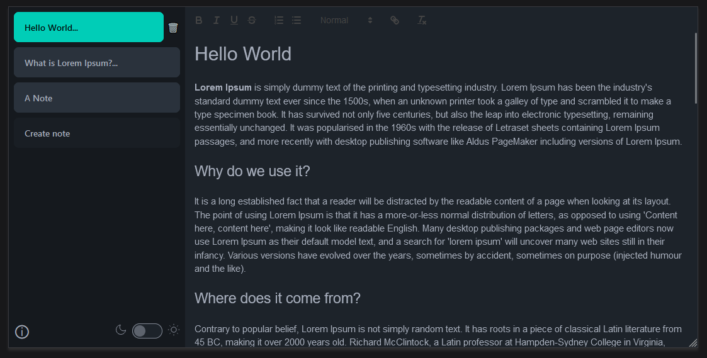

# Simple Notes

PWA app for taking simple notes.

Work in progress.

## Libraries

- Angular 17
- ngx-quill - rich text editor
- Dexie - Indexed DB ORM
- TailwindCSS and DaisyUI - CSS utility classes and styles

## Database

All data is stored locally in the browser. No user data is being collected and no accounts are needed.

- Notes are stored in Indexed DB
- App metadata is stored in Local Storage

## Themes

The app has light and dark theme. It auto-selects theme based on browser preferences.
